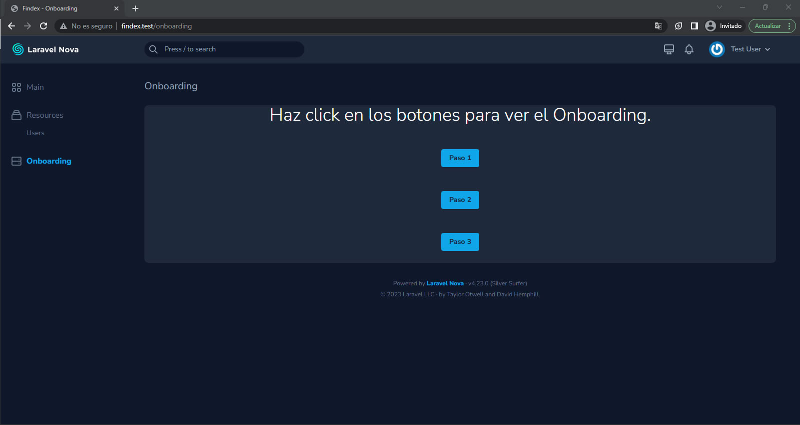

<br/>
<br/>

# :mount_fuji: Reto Técnico Findex.

<br/>
<br/>

## :bookmark_tabs: Tabla de contenido.

<br/>
<br/>

1. [Autor.](#black_nib-autor)

<br/>
<br/>

2. [Detalle de la solución.](#triangular_ruler-detalle-de-la-solución)

<br/>
<br/>

3. [Desplegar.](#airplane-desplegar)

<br/>
<br/>

## :black_nib: Autor.

<br/>
<br/>

**John Fredy Velasco Bareño** [jovel882@gmail.com](mailto:jovel882@gmail.com)

## :triangular_ruler: Detalle de la solución.

<br/>
<br/>

- Esta desarrollado con:
    <br/>
    <br/>
    - PHP 8.1
        <br/>
        <br/>
    - Laravel 10.8
        <br/>
        <br/>
    - Laravel Nova 4
        <br/>
        <br/>

<br/>
<br/>

Se desarrollo basado en los requerimientos descritos en este [enlace](https://docs.google.com/forms/d/e/1FAIpQLSf8xQeJs6uZOgw8HnwgcyAIdDrIT6gkXPoXCgzCvcR6X4PY4g/viewform) y se consiguió lo siguiente:

<br/>
<br/>

+ Se implamento el manejo de SQLite y se dejo el archivo cargando en el repo con data precargada como se indicaba en os requerimientos en [database.sqlite](database/database.sqlite). 

<br/>
<br/>

+ Se precargo la BD atraves del seeder general con 10 usuarios usando el factory de User con datos provistos por faker, ademas de un usuario `test@example.com` y contraseña `123456789`, cuaquier usuario puede usarse para acceder al Nova.

<br/>
<br/>

+ Se instalo Laravel Nova.

<br/>
<br/>

+ Se opto por desarrollar el reto del onboarding de tres pasos usando [vue-onboarding](https://github.com/fatihsolhan/v-onboarding).

	<br/>
	<br/>

	+ Se creo un Tool con el componente que hace el onboarding, este consume un endpoint usando los Nova-Request y las promesas para esperar la respuesta. El entopoint esta dentro del API expuesto en el Tool que le retorna los 3 textos estaticos en un json para que el componente los renderice en el onboarding.

		<br/>
		<br/>

		

		<br/>
		<br/>

		> Para acceder al Laravel Nova ingrese a **http://{DNS}/login/** donde **DNS** se debe cambiar por el de la solucion. Ej. [http://findex.test/login/](http://findex.test/login/)

		<br/>
		<br/>

		

		<br/>
		<br/>

		> Para acceder al Tool ingrese a **http://{DNS}/onboarding/** donde **DNS** se debe cambiar por el de la solucion. Ej. [http://findex.test/onboarding/](http://findex.test/onboarding/)

		<br/>
		<br/>

		

		<br/>
		<br/>

		> Si existe algun problema conectando con el API para traer los textos vera este mensaje.

		<br/>
		<br/>

	+ Se creo un Card que usa el componente generado con el Tool, luego este Card se introdujo dentro del Resource de User para poder tener el Onboarding.

		<br/>
		<br/>

		

		<br/>
		<br/>

		> Para acceder al Resource de User con el Card ingrese a **http://{DNS}/resources/users/** donde **DNS** se debe cambiar por el de la solucion. Ej. [http://findex.test/resources/users/](http://findex.test/resources/users/)

		<br/>
		<br/>

		+ Paso 1.

		<br/>
		<br/>

		

		<br/>
		<br/>

		+ Paso 2.

		<br/>
		<br/>

		

		<br/>
		<br/>

		+ Paso 3.

		<br/>
		<br/>

		

<br/>
<br/>

## :airplane: Desplegar.

<br/>
<br/>

+ Prerrequisitos

    <br/>
    <br/>

    + **Docker >= 20.\***

    <br/>
    <br/>

    + **Docker Compose >=2.\***

    <br/>
    <br/>

    + **Git >=2.\***

    <br/>
    <br/>

+ Pasos

    <br/>
    <br/>

    > :bulb: Si esta sobre algún sistema basado en Linux y ejecuta la siguiente línea se iniciará un ambiente totalmente funcional sobre el DNS [findex.test](http://findex.test/).<br/><br/>
	Antes de ejecutar el comando recuerde cambiar los valores de `USER_NAME_REMPLACE` por el nombre de usuario de key del Laravel Nova y `LICENSE_KEY_REMPLACE` por la Key con la licencia del Laravel Nova.

    <br/>
    <br/>

    ```sh

    git clone https://github.com/jovel882/findex.git && cd findex && cp Docker/.env.example Docker/.env && sed -i -r 's/^(NOVA_USERNAME=).*/\1"USER_NAME_REMPLACE"/' "Docker/.env" && sed -i -r 's/^(NOVA_LICENSE_KEY=).*/\1"LICENSE_KEY_REMPLACE"/' "Docker/.env" && docker compose -f Docker/docker-compose.yml up -d && docker logs -f findex

    ```

    <br/>
    <br/>

    <br/>
    <br/>	

    + Clone el repositorio

        <br/>
        <br/>

        ```sh

        git clone https://github.com/jovel882/findex.git

        ```

        <br/>
        <br/>

    + Ingrese al folder del proyecto.

        <br/>
        <br/>

        ```sh

        cd findex

        ```

        <br/>
        <br/>
            
    + Cree los archivos de entorno basados en los de ejemplo.

        <br/>
        <br/>

        + Genere el ***.env*** dentro del folder de **Docker**, estas son las variables disponibles.

			<br/>
			<br/>

			```sh

			cp Docker/.env.example Docker/.env

			```

			<br/>
			<br/>
			
			+ `COMPOSE_PROJECT_NAME` (\*Requerido): Define el nombre del proyecto que se genera con Docker Compose, en el de ejemplo se deja **findex**.

			<br/>
			<br/>
			
			+ `NOVA_USERNAME` (\*Requerido): Define el nombre de usuario de key del Laravel Nova.

			<br/>
			<br/>
			
			+ `NOVA_LICENSE_KEY` (\*Requerido): Define la Key con la licencia del Laravel Nova.

			<br/>
			<br/>

    + Variables dentro del archivo **"docker-compose.yml"**.

        <br/>
        <br/>

        + Dentro del servicio de nombre **"findex"** en la sección de **"environment"**

            <br/>
            <br/>

            + `VIRTUAL_HOST` (\*Requerido): Define el nombre del DNS sobre el que se levantara el ambiente, por defecto esta **findex.test**.
                
            <br/>
            <br/>

    + Ejecute el docker-compose.yml para levantar el ambiente.
    
        <br/>
        <br/>

        ```sh

        docker compose -f Docker/docker-compose.yml up -d

        ```

        <br/>
        <br/>

    + Siga el estado del despliegue del contenedor principal con el siguiente comando.

        <br/>
        <br/>

        ```sh

        docker logs -f findex

        ```
        <br/>
        <br/>

        > :pushpin: En este log si todo esta correcto podrá ver la instalación de paquetes con Composer, instalación de paquetes con NPM, compilado de archivos con NPM, publicacion de recurso necesarios para Laravel Nova y finalmente el inicio de los servicios del servidor web con Supervisor entre otros.

        <br/>
        <br/>

    + Agregue un registro de host para redirigir las peticiones al **DNS** que se definió en **VIRTUAL_HOST** del archivo **"docker-compose.yml"**. En este [enlace](https://www.siteground.es/kb/archivo-hosts/) hay una forma de hacerlo dependiendo su OS.


		<br/>
		<br/>
		
		**Ejemplo:**	

		<br/>
		<br/>

        ```sh

        127.0.0.1 findex.test

        ```
    <br/>
    <br/>

    + Acceda al resultado de la solución **http://{DNS}/login** donde **DNS** se debe cambiar por el que se definió en **VIRTUAL_HOST** del archivo **"docker-compose.yml"**. Ej. [http://findex.test/login](http://findex.test/login)

    <br/>
    <br/>